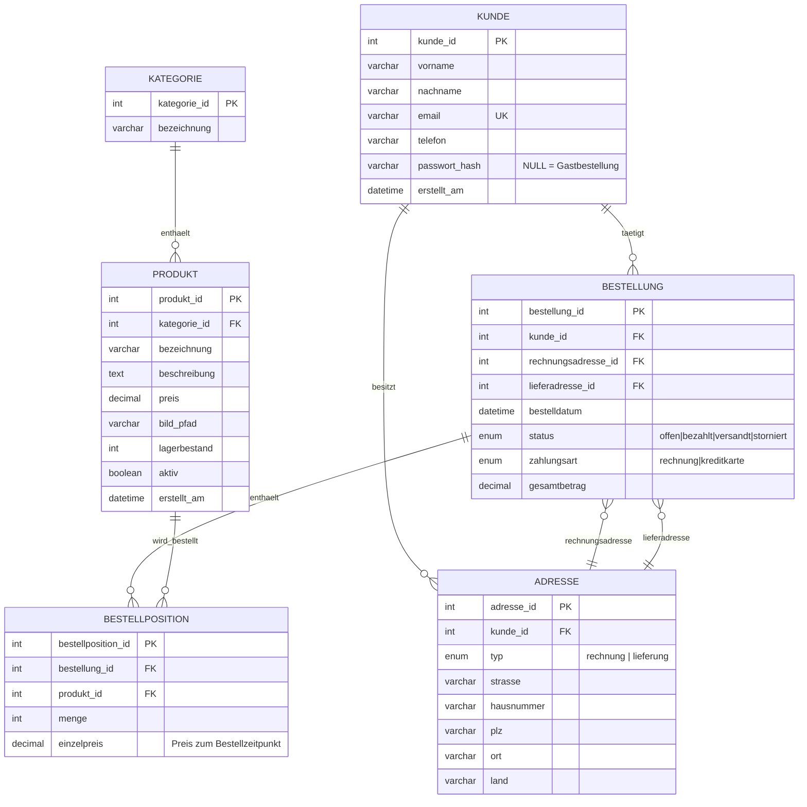

# ER-Diagramm — Webshop

## Entitäten und Beziehungen

## Designentscheidungen

- **Einzelpreis in `BESTELLPOSITION` statt Verweis auf `PRODUKT.preis`**: Produktpreise können sich ändern; für eine korrekte Rechnung (Zusatzaufgabe c) muss der historische Preis zum Bestellzeitpunkt erhalten bleiben.
- **`ADRESSE` getrennt von `KUNDE`, zwei FKs in `BESTELLUNG`**: Rechnungs- und Lieferadresse können unterschiedlich sein und sich unabhängig von den Stammdaten des Kunden ändern; jede Bestellung referenziert die zum Bestellzeitpunkt gültige Adresse.
- **`passwort_hash` nullable**: erlaubt sowohl Gastbestellung als auch optionales Kundenkonto (Zusatzaufgabe b). Wird ein Konto angelegt, wird das Passwort gehasht (`password_hash()`), nie im Klartext gespeichert.
- **`bild_pfad`**: Bilddateien liegen im Dateisystem (`public/assets/img/produkte/`), nur der relative Pfad wird in der DB gespeichert (Vorgabe Punkt 2c).
- **`aktiv` (Soft-Delete) bei `PRODUKT`**: Damit bestehende Bestellpositionen älterer Bestellungen referenziell gültig bleiben, werden Produkte beim "Löschen" (Zusatzaufgabe a) nur deaktiviert statt physisch entfernt.
- **Kein eigenes `WARENKORB`-Tabellenobjekt**: Der Warenkorb wird serverseitig in der PHP-Session gehalten (Produkt-ID + Menge). Das ist ausreichend, da die Aufgabenstellung keine geräteübergreifende Persistenz des Warenkorbs fordert — nur die Kundendaten sollen bei einem Konto wiederverwendbar sein.
- **Statistik-Anforderungen (Punkt 6)** werden direkt über Aggregat-Queries auf `BESTELLPOSITION`/`BESTELLUNG` abgebildet, keine zusätzlichen Tabellen nötig:
  - Meist-/seltenbestellte Produkte: `SUM(menge)` gruppiert nach `produkt_id`, sortiert auf-/absteigend, `LIMIT 5`.
  - Bestellungen der letzten 4 Wochen: `WHERE bestelldatum >= NOW() - INTERVAL 4 WEEK`.
